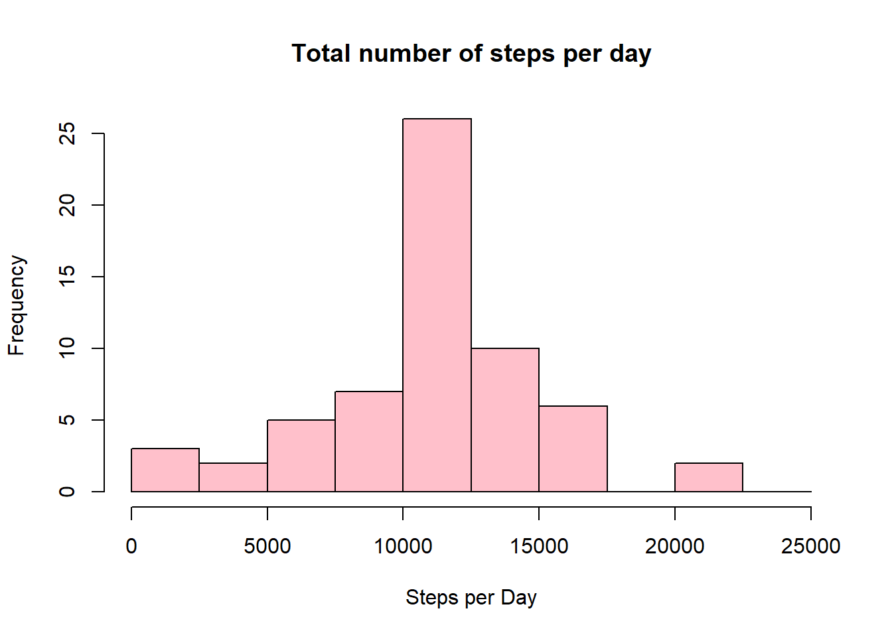

# Reproducible Research: Peer Assessment 1

The goal of this assignment is to do an data analysis of an individual's activities from data collected by personal activity monitoring device like smart phones.
This device collects data at 5 minute intervals through out the day. The data consists of two months of data, with steps taken in 5 minute intervals each day.


## Loading and preprocessing the data
Here first, unzipping the zip file to load the csv data,then loading
the data with header, removing the missing values then converting the type of date
column from char format to date format.


```r
unzip("activity.zip")
raw_data <- read.csv("activity.csv",header = T)
data <- na.omit(raw_data)
data$date <-as.Date(data$date)
raw_data$date <- as.Date(raw_data$date)
```

Just having a look at the data of first 6 rows

```r
head(data)
```

```
##     steps       date interval
## 289     0 2012-10-02        0
## 290     0 2012-10-02        5
## 291     0 2012-10-02       10
## 292     0 2012-10-02       15
## 293     0 2012-10-02       20
## 294     0 2012-10-02       25
```


## What is mean total number of steps taken per day?


```r
total_steps <- aggregate(data$steps,by = list(data$date),FUN =sum )
colnames(total_steps) <- c("Date","Steps")
total_steps
```

```
##          Date Steps
## 1  2012-10-02   126
## 2  2012-10-03 11352
## 3  2012-10-04 12116
## 4  2012-10-05 13294
## 5  2012-10-06 15420
## 6  2012-10-07 11015
## 7  2012-10-09 12811
## 8  2012-10-10  9900
## 9  2012-10-11 10304
## 10 2012-10-12 17382
## 11 2012-10-13 12426
## 12 2012-10-14 15098
## 13 2012-10-15 10139
## 14 2012-10-16 15084
## 15 2012-10-17 13452
## 16 2012-10-18 10056
## 17 2012-10-19 11829
## 18 2012-10-20 10395
## 19 2012-10-21  8821
## 20 2012-10-22 13460
## 21 2012-10-23  8918
## 22 2012-10-24  8355
## 23 2012-10-25  2492
## 24 2012-10-26  6778
## 25 2012-10-27 10119
## 26 2012-10-28 11458
## 27 2012-10-29  5018
## 28 2012-10-30  9819
## 29 2012-10-31 15414
## 30 2012-11-02 10600
## 31 2012-11-03 10571
## 32 2012-11-05 10439
## 33 2012-11-06  8334
## 34 2012-11-07 12883
## 35 2012-11-08  3219
## 36 2012-11-11 12608
## 37 2012-11-12 10765
## 38 2012-11-13  7336
## 39 2012-11-15    41
## 40 2012-11-16  5441
## 41 2012-11-17 14339
## 42 2012-11-18 15110
## 43 2012-11-19  8841
## 44 2012-11-20  4472
## 45 2012-11-21 12787
## 46 2012-11-22 20427
## 47 2012-11-23 21194
## 48 2012-11-24 14478
## 49 2012-11-25 11834
## 50 2012-11-26 11162
## 51 2012-11-27 13646
## 52 2012-11-28 10183
## 53 2012-11-29  7047
```

Histogram of total steps taken per day

```r
library(ggplot2)
g <- ggplot(total_steps,aes(Steps))
g+geom_histogram(fill = "purple",binwidth = 2500,boundary=0,col="lightblue")+  labs(x="Steps",y="Frequency")+scale_x_continuous(breaks=seq(0,25000,2500))+scale_y_continuous(breaks=seq(0,18,2))+ggtitle("Histogram of steps per day")
```

<!-- -->


Mean of Steps taken

```r
mean(total_steps$Steps)
```

```
## [1] 10766.19
```
Median of Steps taken 

```r
median(total_steps$Steps)
```

```
## [1] 10765
```

## What is the average daily activity pattern?

Let's make a time series plot with average no of steps as taken in Y-axis 

```r
average_steps <- aggregate(data$steps,by =list(data$interval),FUN=mean)
colnames(average_steps) <- c("intervals","mean")
plot(average_steps$intervals,average_steps$mean,type="l",col="green",lwd=2.5,
     xlab="Intervals",ylab = "Average number of steps per interval",
     main = "Average number of steps per intervals")
```

<!-- -->

Which 5-minute interval, on average across all the days in the dataset, contains the maximum number of steps?


```r
average_steps[which.max(average_steps$mean),]$interval
```

```
## [1] 835
```


## Imputing missing values
There are a number of days/intervals where there are missing values (coded as NA). The presence of missing days may introduce bias into some calculations or summaries of the data.

Calculate and report the total number of missing values in the dataset (i.e. the total number of rows with NAs)


```r
sum(is.na(raw_data$steps))
```

```
## [1] 2304
```
Devise a strategy for filling in all of the missing values in the dataset. The strategy does not need to be sophisticated. For example, you could use the mean/median for that day, or the mean for that 5-minute interval, etc.


```r
raw_data$Updated_steps<- ifelse(is.na(raw_data$steps), round(average_steps$mean[match(raw_data$interval, average_steps$intervals)],0), raw_data$steps)
```

Create a new dataset that is equal to the original dataset but with the missing data filled in.


```r
UpdatedData <- raw_data[,c(4,2,3)]
head(UpdatedData)
```

```
##   Updated_steps       date interval
## 1             2 2012-10-01        0
## 2             0 2012-10-01        5
## 3             0 2012-10-01       10
## 4             0 2012-10-01       15
## 5             0 2012-10-01       20
## 6             2 2012-10-01       25
```


Make a histogram of the total number of steps taken each day and Calculate and report the mean and median total number of steps taken per day. Do these values differ from the estimates from the first part of the assignment? What is the impact of imputing missing data on the estimates of the total daily number of steps?


```r
total_Steps <- aggregate(Updated_steps~date,UpdatedData,sum)
colnames(total_Steps)= c("Date","Daily_Steps")
hist(total_Steps$Daily_Steps,main = "Total number of steps per day",col="pink",
     xlab = "Steps per Day",breaks = seq(0,25000,2500))
```

<!-- -->


Mean of Steps taken

```r
mean(total_Steps$Daily_Steps)
```

```
## [1] 10765.64
```
Difference between those 2 means is 0.55 

Median of Steps taken 

```r
median(total_Steps$Daily_Steps)
```

```
## [1] 10762
```

Difference between those 2 median is 3 

Therefore the bias occurred in data is resolved by replacing NA values with approximate means 


## Are there differences in activity patterns between weekdays and weekends?

Create a new factor variable in the dataset with two levels – “weekday” and “weekend” indicating whether a given date is a weekday or weekend day.


```r
data$weekday <- weekdays(data$date)
data$datetype <- sapply(data$weekday,function(x) {
        if(x=="Saturday" | x=="Sunday")
        {
                y <- "Weekend"
        } else
        {
                y <- "Weekday"
        }
        y
})
head(data)
```

```
##     steps       date interval weekday datetype
## 289     0 2012-10-02        0 Tuesday  Weekday
## 290     0 2012-10-02        5 Tuesday  Weekday
## 291     0 2012-10-02       10 Tuesday  Weekday
## 292     0 2012-10-02       15 Tuesday  Weekday
## 293     0 2012-10-02       20 Tuesday  Weekday
## 294     0 2012-10-02       25 Tuesday  Weekday
```

Make a panel plot containing a time series plot (i.e. type = “l”) of the 5-minute interval (x-axis) and the average number of steps taken, averaged across all weekday days or weekend days (y-axis).


```r
week_activity <- aggregate(steps~interval+datetype,data = data,FUN = mean)
g <- ggplot(week_activity,aes(x=interval,y=steps,color=datetype))+geom_line()+labs(x="Time Interval",y="Average no. of steps")+facet_grid(datetype~.)+ggtitle("Average steps per time interval : WeekDays vs Weekends")
plot(g)
```

<!-- -->

